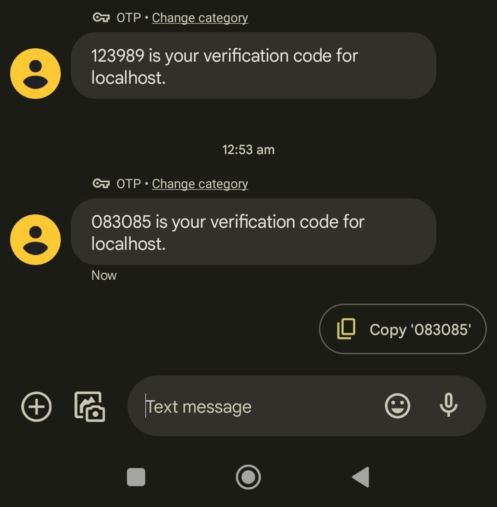

# Qube_Health_Assignment
This is the implementation to the assignment provided by Qube Health.
This project is a simple web application that allows the registered users to upload and maintain their documents. The documents are stored in the database and can be accessed by the users anytime. Users can only be registered by the admin possessing the credintials of Master login. Diching the less secured password protection, here authentication is done using One Time Password sent to the User's or Admin's registered contact number.

# How to run the project
1. First install the dependencies: PHP and XAMPP
2. Either clone this repository using this command in gitBash  
` git clone https://github.com/Sahil-Chavan/Qube_Health_Assignment.git `  
or download it in zip format and extract the project folder.  
download link for zip folder: `https://github.com/Sahil-Chavan/Qube_Health_Assignment/archive/refs/heads/main.zip`
3. The project folder should be located in 'htdocs' folder in 'xampp' directory.
4. I have provided the SQL DB file in the folder 'database'. Import it using the Phpmyadmin console.
5. Open the XAPMM control panel and switch ON the Apache and MySQL service modules.
6. Access the project through 'localhost' on browser, i.e access it using one of those links

			i. http://localhost/Qube_Health_Assignment/
			
			ii. http://127.0.0.1/Qube_Health_Assignment/
			
			
# Features and Functionality of the project
## A) Master Module
### 1. Login
For demostration purpose I haven't kept any authorization for contact numbers that are to be entered. That is there is no fixed or limited access to master dashboard.
So anyone with valid contact number and correct OTP can access master dashboard. This was done purposely so that the reviewers of this project can have master access.

Hence to access master dashboard, enter appropriate contact number (registered in India), verify the reCAPTCHA and ask for OTP. Then the OTP will be sent to the entered contact number using the Firebase OTP API service. Input the correct OTP and the access to master dashboard is granted.

### 2. Register User
Master has an authority to register new Users. One can do this by providing the name and contact number in the form provided in the dashboard. With valid data new user gets registered by storing its data onto an SQL database.

## B) User Module
### 1. Login
Here only the registered users have acces to user dashboard. One has to enter the registered contact number, verify the reCAPTCHA and ask for OTP. Only if the contact number exists in SQL table of registered users (maintained by Master), OTP is sent to the entered contact number and allowed to enter OTP. Input the correct OTP and the access to user dashboard is granted.

### 2. Upload Document
User has the ability to upload their documents using the form provided on the user dashboard. Enter the appropriate name for the file, browse to the correct file and upload by clickig the 'Upload File' button.

### 3. Document Table
Document table showcase all the presently uploaded files of the user. It provides the functionality to either view or download the files and also allows to delete the files. 

# Screenshots
### These are some screenshots of the project
- Master login page.

- Scenario when incorrect OTP is entered.

- User login page. Scenario when unauthorized users are blocked. 

- OTP is sent when correct contact number is provided by authorized user.

- Registration form provided on master dashboard.

- Scenario when an new user is registered by providing appripriate and valid data.

- User dashboard providing the functionality to upload, view and delete user's files.

- OTP message recieved on cellphone.

